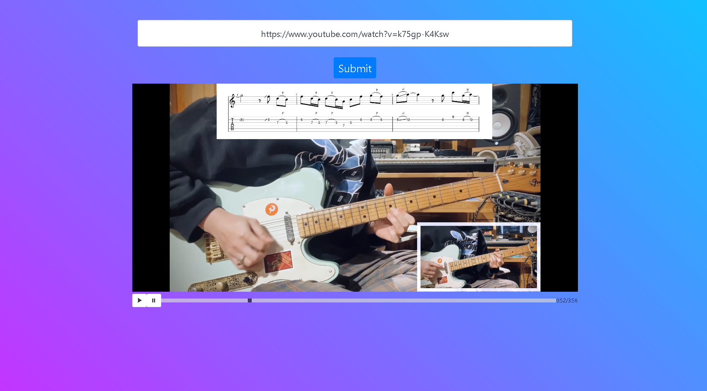

## YouTube Watch Party

**Project description:** A watch party app for the video platform YouTube. Using NodeJS, EJS and WebSocket API as well as consulting YouTube API documents, I made simple algorithms to embed and synchronize the video for every users on the website. This was especially useful because of the COVID-19 pandemic when everyone is in quarantine, so the application was a way to connect and watch YouTube together although being far away. The application can be use by anyone and with any YouTube links.

